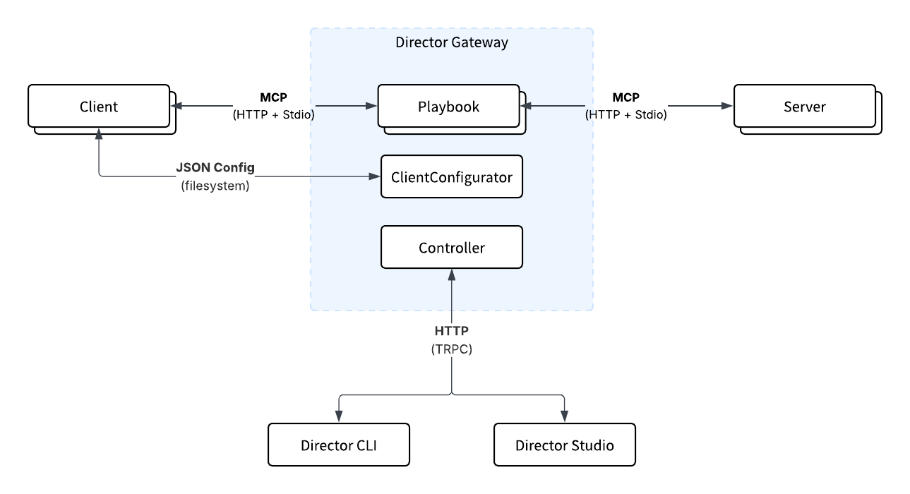

<Frame caption="Director architectural overview">
  
</Frame>

Director is a service that sits between your AI agents and MCP servers. It acts as a middleware for organizing and managing MCP capabilities. It's transparent to clients, requiring no additional tokens or configuration changes.

## Core Concepts

### Playbooks

A **playbook** is a set of tools, prompts, and configuration that gives your AI agent new skills. Think of playbooks as portable, declarative skill sets that can be:
- Shared across teams via version control (YAML files)
- Connected to multiple clients (Claude, Cursor, VSCode) with 1-click
- Configured to include only the tools needed for specific tasks
- Enforced declaratively (like Terraform for AI agents)

### Gateway

The `Gateway` implements a proxy pattern in order to:
- Aggregate multiple MCP servers into a single playbook endpoint
- Support all MCP transports (HTTP Streamable, Stdio, SSE)
- Provide tool filtering to preserve context
- Offer unified OAuth for centralized authentication

### Client Integration

Director provides multiple ways to connect MCP clients:

- **1-Click Integration**: Automatically configure Claude, Cursor, or VSCode via the `ClientConfigurator`
- **Manual Integration**: Use standard MCP connection details for any MCP-compliant client
- **Declarative Mapping**: Define client-to-playbook connections in config that are enforced on startup

## Management Interfaces

Director can be managed through multiple interfaces:

- [CLI](../concepts/cli): Primary management tool (npm installable) - `director serve`, `director create`, etc.
- [Studio](../concepts/studio): Web interface for visual playbook and server management
- **SDK**: Programmatic control via TypeScript SDK for advanced use cases
- **Config File**: Direct YAML editing at `~/.director/director.config.yaml`

## Architecture Components

- **Gateway**: Core service that runs the playbooks and serves MCP clients
- **Controller**: HTTP API (TRPC) for dynamic playbook management
- **ClientConfigurator**: Automates client connection setup without manual JSON editing
- **Registry**: Discover and add MCP servers from the community registry