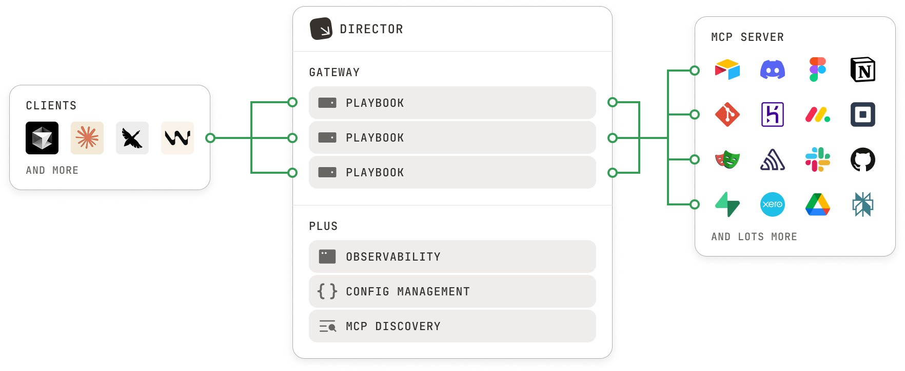

import { BetaBadge } from '/snippets/beta-badge.mdx'

<Frame caption="Director overview">
  
</Frame>

[Director](https://director.run) allows you to provide **playbooks** to AI Agents. A playbook is a set of **MCP tools**, **prompts** and **configuration** that give agents new **skills**. You can connect Claude, Cursor and VSCode in 1-click, or integrate manually through a single MCP endpoint.

Playbooks are portable, declarative YAML files that can easily be shared (or committed to version control). Director is local-first - installation and client integration takes 30 seconds. Director provides all the MCP management functionality you'd expect: tool filtering, logging, strong isolation, and unified OAuth.

## Key Features

#### 📚 Playbooks
Maintain sets of tools, prompts and config for different tasks or environments.

#### 🚀 1-Click Integration
Switch playbooks with a single click. Currently supports Claude Code, Claude Desktop, Cursor, VSCode.

#### 🔗 Shareable
Playbooks are flat files which can be shared or committed to version control easily.

#### 🏠 Local-First
Director is local-first, designed to easily run on your own machine or infrastructure.

#### 🔑 Unified OAuth
Connect to OAuth MCPs centrally, and use them across all of your agents.

#### 🎯 Tool Filtering
Select only the MCP tools that are required for the specific task, preserving context.

#### 📋 Declarative
Like terraform for AI agents, Director will enforce playbook to client mapping on startup.

#### 🔧 Flexibility
Configure director through the UI, by editing the config file, through the CLI or using the Typescript SDK.

#### 📊 Observability
Centralized JSON logging that allows you to understand exactly what your agent is doing.

#### 🔌 MCP Compliant
Just works with any MCP server or client. Up to date with the latest MCP spec.

#### MCP Registry
Discover and evaluate MCP servers securely. Browse available servers through the [Studio](./studio) or CLI.
